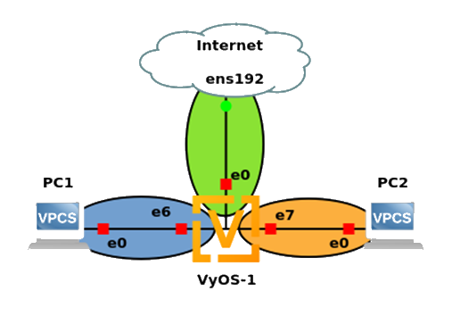

## ITS 2300 - Lab 7
### Task 1 - Document your network

1.  Complete the following IP grid, with the following policy.

-   Use the IP address space 10.M.0.0/16

-   Split the network provided into two networks.

-   LAN1 with enough space for 100 DHCP configured computers out of the address space.

-   LAN2 with enough space for 250 DHCP configured computers out of the address space.

-   Networks must be minimized while allowing for 100% growth.

  
|                   |**WAN**            |**LAN1**           |**LAN2**
|--                         |--                 |--                 |--
|Description                |To Internet        |To PC1&nbsp; &nbsp; &nbsp; &nbsp; &nbsp; &nbsp; &nbsp; &nbsp; &nbsp; &nbsp; &nbsp; &nbsp; &nbsp; &nbsp;             |To PC2&nbsp; &nbsp; &nbsp; &nbsp; &nbsp; &nbsp; &nbsp; &nbsp; &nbsp; &nbsp; &nbsp; &nbsp; &nbsp; &nbsp; &nbsp; &nbsp; &nbsp; &nbsp;
|Router Interface           |eth0               |eth6               |eth7
|Network Address            |132.235.160.128    |                   |
|CIDR Netmask               |/26                |                   |
|Static client address      |From Blackboard    |--Not Applicable-- |--Not Applicable--
|DHCP Pool Start            |--Not Applicable-- |                   |
|DHCP Pool Stop             |--Not Applicable-- |                   |
|Gateway Address            |132.235.160.190    |                   |                         

2.  Create a network recipe that addresses interface configurations, default route, and dhcp pools.

### Task 2 - Deploy the network

3.  Deploy following GNS3 project but connect to the "PublicNet".



4.  Apply the VyOS configuration developed in the earlier task

5.  Start both VPCS (if not already running).

6.  Using info from previous lab have both VPCS obtain a DHCP IP.

7.  From the VPCS Console run the following commands:

    a.  See stats about the IP just obtained using show ip

    b.  Ping the local gateway using ping \<LAN_GATEWAY\>

### Task 3 - Network Address Translation

8.  Start a packet capture on the connection between VyOS and the WAN cloud.
9.  Ping a reliable IP address from VPCS-1.
10. Filter for `icmp` and save packets with "Export Specified Packets" for later processing.
11. Using the following template to configure NAT on the VyOS router.

```
set nat source rule 100 outbound-interface <OUTBOUND_INTEFACE>
set nat source rule 100 source address <INTERNAL_IP_NET>
set nat source rule 100 translation address masquerade
```

**Note:** IP address and mask used must encompass BOTH subnets.

12. Start two packet captures between:

    a.  VyOS-1 and VPCS-1.

    b.  VyOS-1 and the Internet Cloud.

13. Ping a reliable IP address from VPCS-1.

14. Filter for `icmp` and save packets with "Export Specified Packets" on each packet capture for later processing.

### Lab Questions

1.  Using your preferred tool, draw a network diagram of the resulting network, including connections, port numbers, DHCP pools, and addresses.

2.  Using the saved packet captures show a ping request and the associated ping response show and describe the changes that are caused by the NAT.

3.  The network address translation configuration described in this class is often referred to as Forward NAT. Find a relevant Internet based resource for reverse NAT.

4.  Propose an application of the reverse NAT function.
